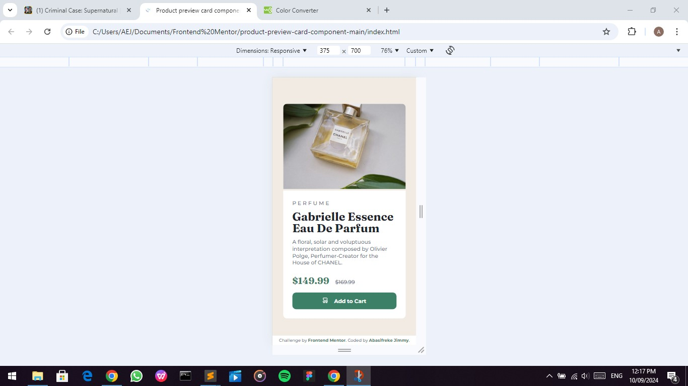

# Frontend Mentor - QR code component solution

This is a solution to the [QR code component challenge on Frontend Mentor](https://www.frontendmentor.io/challenges/qr-code-component-iux_sIO_H).

## Table of contents

- [Overview](#overview)
  - [Screenshot](#screenshot)
  - [Links](#links)
- [My process](#my-process)
  - [Built with](#built-with)
  - [What I learned](#what-i-learned)
  - [Continued development](#continued-development)
  - [Useful resources](#useful-resources)
- [Author](#author)
- [Acknowledgments](#acknowledgments)


## Overview

### Screenshot




### Links

- Solution URL: (https://github.com/Abas-code/product-preview-card-component-main)
- Live Site URL: ()

## My process

### Built with

- Semantic HTML5 markup
- CSS custom properties
- Flexbox
- Mobile-first workflow

### What I learned

I learnt how to vertically arrange elements using flexbox.

```css
section {
  display: flex;
  flex-direction: column;
  justify-content: space-between;
}
article {
  display: flex;
  flex-direction: column;
  justify-content: space-between;       
}
```

### Continued development

I discovered this CSS declaration from fonts.google.com on how to use variable fonts. Trying comprehend it. 

```css
@font-face {
  font-family: 'FAMILY_NAME';
  font-stretch: PERCENTAGE_RANGE_LOW_TO_HIGH;  Note that font-stretch is a % of normal width 
  font-style: NORMAL_OR_ITALIC;  See note below 
  font-weight: NUMERIC_RANGE_LOW_TO_HIGH;
  src: url(FONT_FILE_NAME.woff2) format('woff2');
}
```

### Useful resources

- [W3Schools](https://www.w3schools.com)


## Author

- Frontend Mentor - [@Abascode](https://www.frontendmentor.io/profile/Abascode)


## Acknowledgments

I want to acknowledge my friend, Emmanuel who pointed out to me the flex-direction property.